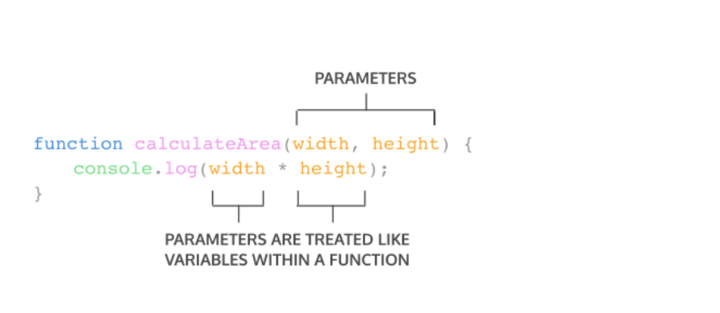
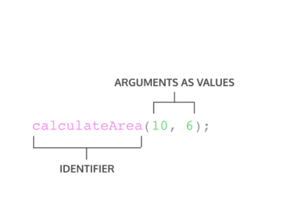

# <center>**Writing  Week 2**

## **Looping**<hr>
- ### **Deskripsi Loop**
  <div align="justify">
  Looping merupakan statement yang mengulang suatu instruksi hingga kondisi terpenuhi atau jika kondisi stop atau berhenti.<br>

  - Contoh macam Loop :
    - For Loop
    - While Loop
    - Do While Loop

  - Gambaran kapan kita harus menggunakan dari 3 macam Loop diatas.

    

- ### **For Loop**
  <div align="justify">
  digunakan jika kita tahu pasti seberapa banyak pengulangan yang ingin dilakukan pada program yang akan dikembangkan<br>
  contohnya :

  ```javascript
  for (let i = 1; i <= 10 ; i++) {
  console.log(i)
  }
  ```
- ### **While Loop**
  <div align="justify">
  While Loop akan menjalankan instruksi pengulangan bernilai TRUE Ada 2 macam while loop yaitu while dan do while<br>
  contoh perulangan while :

  ```javascript
  let i = 1 ; 
    while (i < 10){
        console.log(i);
        i ++ ;
    } 
  ```

- ### **Do While Loop**
  <div align="justify">

  ```javascript
  let i = 1;
  do {
    console.log(i);
    i++;
  } while (i <= 10);
  ```
- ### **Loop dengan Percabangan**

  ```javascript
    for (let i = 1; i <= 10 ; i++) {
    if (i == 6) {
      console.log(i , "yess ketemu")
    } else {
      console.log(i)
    }
  }
  ```
## **JavaScript Scope dan Function**<hr>
- ### **Scope**
  <div align="justify">
  adalah konsep dalam flow data variabel. Menentukan suatu variabel bisa diakses pada scope tertentu atau tidak.

- ### **Blocks**
  <div align="justify">
  Blocks adalah code yang berada didalam curly braces {}. Conditional, function, dan  looping menggunakan blocks.

- ### **Global Scope**
  <div align="justify">
  Global scope berarti variabel yang kita buat dapat diakses dimanapun dalam suatu file.Agar menjadi Global Scope, suatu variabel harus dideklarasikan diluar Blocks.<br>
  Contoh Global Scope :
 
  ```javascript
  let myName = "chaca" ; 
  function greeting()
     return myName;
  {
     console.log(myName);
  ```

- ### **Local Scope**
  <div align="justify">
  Local scope berarti kita mendeklarasikan variabel didalam blocks seperti function, conditional, dan looping.Maka variabel hanya bisa diakses didalam blocks saja. Tidak bisa diakses diluar blocks.<br>
  Contoh Local Scope :

    ```javascript
    function greetting(){
        let myName = "Guntur";
        return myName;
    }
    console.log(gretting())
    console.log(myName);
    ```

- ### **Function**
    <div align="justify">Function adalah sebuah code blok dalam sebuah grup untuk menyelesaikan 1 task.<br>
    
    *Cara memanggil function :*
    ```javascript
    myFunction()
    console.log(myFunction());
    ```

    *Cara membuat function ada 3 :*
    - **Function Clasic**
        ```javascript
        function myFunction(kondisi) { }
        ```
    - **Function Variable**
        ```javascript
        let myFunction = function (kondisi) { }
        ```
    - **Arrow Function**
        ```
        let myFunction = (kondisi) => { }
        ```

- ### **Parameter Function**
    - <div align="justify">
      Dengan parameter, function dapat menerima sebuah inputan data dan menggunakannya untuk melakukan task/tugas.
    - <div align="justify">
      Saat membuat function/fitur, kita harus tahu data-data yang dibutuhkan. Misalnya saat membuat function penambahan 2 buah nilai. Data yang dibutuhkan adalah 2 buah nilai tersebut.

      ```javascript
      function penambahan (a,b){ // (a,b) merupakan parameter
          return a + b;
      }
      ```
    **contoh**
       

- ### **Argumen Function**
    - <div align="justify">
      Argumen adalah nilai yang digunakan saat memanggil function.
    - <div align="justify">
      Jumlah argumen harus sama dengan jumlah parameternya

      ```javascript
      function penambahan (a,b){ // (a,b) merupakan parameter
          return a + b;
      }
      console.log(penambahan(5,5)) // (5,5) adalah argumen
      
      ```
       **contoh**
       

      
  ### **Default Parameter**
   <div align="justify">
     Default paramaters digunakan untuk memberikan nilai awal/default pada parameter function.
     Default parameters bisa digunakan jika kita ingin menjaga function agar tidak error saat dipanggil tanpa argumen

    - <div align="justify">
      Jumlah argumen harus sama dengan jumlah parameternya
     ```javascript
      function greet0nWebsite(name =  `Stranger`){
        return `hello`+name;
      } 
      console.log(greet0nWebsite(`David`)); //output : `Hello David`
      console.log(greet0nWebsite); //output : `hello Stranger`

    ```

     ### **Arrow Function**  
     <div align="justify">
     Arrow function adalah cara lain menuliskan function. Ini adalah fitur terbaru yang ada pada ES6 (Javascript Version)
    
     ```javascript
      const greeting  = () => {
        return `Hello World`
      }
      const penambahan = (a,b) =>{
        return a+b;
      }
     ```
## JavaScript Prototype and Method
- Properties adalah nilai yang berkaitan dengan objek pada JavaScript.Properties biasanya dapat diubah, ditambahkan, dan dihapus, tetapi beberapa hanya dapat dibaca.
- Method JavaScript adalah properti yang berisi definisi fungsi. Metohd adalah fungsi yang disimpan sebagai properti objek

- Data Type
    - javascript merupakan bahasa pemograman yang dinamis
    - JavaScript memiliki 2 jenis tipe data :
    1. Type Data Primitive
        <div align="justify">Primitive itu tipe data yang masih standar yang masih low level
    2. Type Data Non-Primitive
        <div align="justify">Non-primitive merupakan tipe data kembangan dari tipe data primitive.

        <br>

    **Type Data Primitive**
    - string - deretan karakter yang diapit oleh sepasang tanda kutip;
    - number - bilangan bulat, pecahan, dan lain-lain;
    - boolean - nilai benar dari sebuah pernyataan yang dituliskan sebagai true atau false;
    - null - sebuah nilai yang berarti kosong atau menunjuk pada nilai yang tidak ada;
    - undefined - berbeda dari null, undefined menandakan kondisi variabel yang belum diberi sebuah nilai. Jadi pernyataan "nilai variabel itu adalah undefined" sebenarnya kurang tepat, sebab variabelnya memang tidak mempunyai sebuah nilai;
    - symbol - sebuah nilai unik yang dihasilkan tiap kali kita memanggil fungsi Symbol(). Nilai unik ini memiliki beberapa kegunaan seperti memberi nomor identifikasi unik dan berperan sebagai nama properti unik sebuah objek;

    **Type Data Non-Primitive**
    - object - sebuah kumpulan pasangan properti dan nilai. Seperti objek dalam kehidupan sehari-hari saja. Misalnya objek Apel memiliki properti warna dengan nilai merah.

    <br>

- ### **String JavaScript**
    <div align="justify">Tipe data yang terdiri dari kumpulan karakter yang berurutan. Ditulis dalam tanda kutip tunggal atau ganda (' ')/(" ").

    - Beberapa operasi yang paling sering digunakan pada string adalah memeriksa panjangnya, membangun dan menggabungkannya menggunakan operator string and, memeriksa keberadaan atau lokasi substring dengan metode indexOf(), atau mengekstrak substring dengan metode substring().

<br>

-  Penggunaan Properties 
    - Mengecek jumlah karakter
        ```javascript
        console.log(hewan.length);
        ```
- Penggunaan Method
    - Mengecek tipe data yang di gunakan
        ```javascript
        let hewan = "kAnCIl"
        console.log(typeof hewan) // string
        ```
    - Merubah huruf menjadi huruf besar
        ```javascript
        console.log(hewan.toUpperCase())
        ```
    - Merubah huruf menjadi huruf kecil
        ```javascript
        console.log(hewan.toLowerCase())
        ```
    - Mengembalikan karakter sesuai index yang sudah di tentukan
        ```javascript
        console.log(hewan.charAt(1))
        ```
    - mencari sebuah kata atau karakter pada sebuah string
        ```javascript
        console.log(hewan.includes("s")) // true
        ```

    - Memisahkan sebuah string menjadi data array dengan split()
        ```javascript
        let kalimat = "dengan menggunakan split(), kita dapat memisahkan sebuah string menjadi data array"

        console.log("BEFORE", kalimat)
        console.log("AFTER", kalimat.split(" "));
        ```
- ### **Number JavaScript**
    <div align="justify">Number merupakan tipe data yang digunakan untuk menunjukan angka, baik positif maupun negatif. Number juga merupakan tipe data yang digunakan untuk menunjukan notasi matematika.
    
    <br>

    - Penggunaan Method dan properties pada Number
        - Mengecek not number (bukan angka)
            ```javascript
            console.log(isNaN(2131)) // false
            console.log(isNaN("dawdf")) // true
            console.log(isNaN(true)) // false karena true == 1
            ```
        - Merubah angka menjadi Number
            ```javascript
            let angka = 20
            cosnloe,log(angka.toString) // "20"
            ```
        - menentukan jumlah angka di belakang koma(,)
            ```javascript
            let angka = 3.12345
            console.log(angka.toFixed(1)) // 3.1
            console.log(angka.toFixed(2)) // 3.12
            ```

- ### Math JavaScript
    <div align="justify">Math adalah objek yang  telah di sediakan oleh javascript dengan math ini kita bisa bermain menolah data. 
    
    - Math memiliki berbagai macam properties .Contoh :
        ```javascript
        console.log(Math.PI) // 3.141592653589793
        console.log(Math.LOG2E) // 1.4426950408889634
        ```
    - Method pada math
        - mengembalikan nilai bulat
            ```javascript
            console.log(Math.abs(-5)) // 5
            ```
        - mencari nilai hasil perpangkatan
            ```javascript
            console.log(Math.pow(3,2)) // 9
            ```
        - Mencari akar dari sebuah nilai
            ```javascript
            console.log(Math.sqrt(9)) // 3
            ```
        - Membulatkan angka
            ```javascript
            console.log(Math.round(123.123)) // 123
            ```
        - Membulatkan angka kebawah
            ```javascript
            console.log(Math.floor(20.5)) // 20
            ```
        - Membulatkan angka ke atas
            ```javascript
            console.log(Math.ceil(20.5)) // 21
            ```

- ### Contoh kasus
    Membalikkan string
    <div align="justify">hallo -> ollah

    ```javascript
    // membuat method baru utk tipe data string
    String.prototype.reverse = function(){
    let s = ""
    for (let i = String(this).length-1; i >= 0 ; i--) {
        s = s + String(this)[i]
    }

    return s
    }

    // method yg dimiliki oleh string
    console.log("hallo".reverse())
    console.log("selamat datang".reverse())
    ```

    <br>

## **Javascript : DOM**
- DOM singkatan dari Document Object Model. DOM adalah Programing interface pada document web. DOM ini mempresentasikan halaman dimana kita bisa merubah struktur style , konten.
- DOM merupakan bukan bagian dari JavaScript/Bahasa pemrograman melainkan ini adalah sebuah web API untuk membanggun Websit yang artinya bisa di gunakan untuk bahasa pemrograman yang lain.
- DOM merupakan jembaatan supaya bahasa pemrograman dapat berinteraksi dengan dokumen HTML.
- Dengan DOM, Javascript dapat memanipulasi HTML.


- ### **DOM - Traversing Elemets**
    <div align="justify">Menelusuri atau menjelajahi elemen - elemen menggunakan DOM. kali ini trafersing di kategorikan 3 bagian seperti berikut :

    <br>

    - Contoh file index.html
        ```javascript
        <!DOCTYPE html>
        <html lang="en">
        <head>
            <meta charset="UTF-8" />
            <meta http-equiv="X-UA-Compatible" content="IE=edge" />
            <meta name="viewport" content="width=device-width, initial-scale=1.0" />
            <title>Document</title>
        </head>
        <body>
            <h1 id="title">Hallo</h1>

            <ul class="list">
            <li class="item">satu</li>
            <li class="item">dua</li>
            <li class="item">tiga</li>
            </ul>

            <!-- Latihan -->
            <div class="hewan">
            <ul class="mamalia">
                <li>kucing</li>
                <li>kelinci</li>
                <li>kambing</li>
            </ul>

            <ul class="reptil">
                <li>kadal</li>
                <li>ular</li>
                <li>buaya</li>
            </ul>

            <ul class="unggas">
                <li>ayam</li>
                <li>bebek</li>
                <li>burung</li>
            </ul>
            </div>


            <script src="./script.js"></script>
        </body>
        </html>
        ```
<br>

- Mengakses DOM dengan traversing
    - Traversing kategori Ke Bawah
        - getElementById
            <div align="justify">Mengembalikan data dalam bentuk kumpulan dari elemen berdasakan nama ID nya

            ```javascript
            let title = document.getElementById("title")
            console.log(title) // <h1 id="title">Hallo</h1>
            ```
            
        - getElementsByClassName
            <div align="justify">Mengembalikan data dalam bentuk kumpulan dari elemen berdasakan nama class nya

            ```javascript
            let items = document.getElementsByClassName("item")
            console.log(items[2]); // <li class="item">tiga</li>
            ```

        - getElementsByTagName
            <div align="justify">Mencari Element berdasarkan nama tag nya

            ```javascript
            let itemByTag = document.getElementsByTagName("li")
            console.log(itemByTag[1])
            console.log(itemByTag.item(1))
            console.log(itemByTag.length)
            ```
        - querySelector
            ```javascript
            let listQuery = document.querySelector(".list")
            console.log(listQuery);
            ```
        - querySelectorAll
            ```javascript
            let itemQueryAll = document.querySelectorAll(".item")
            console.log(itemQueryAll)

            let itemQueryAll = document.querySelectorAll(".item")
            console.log(itemQueryAll) // mendapatkan data dalam bentuk node list
            ```

        <br>

    - Traversing ke atas
        - parentElement
            <div align="justify">Akses Parentsnya 
            ```javascript
            console.log(itemQuery.parentElement); // <ul class="list">...</ul>
            ```
        - closest
            <div align="justify">akses parents terjauhnya
            ```javascript
            console.log(itemQuery.closest(".list"));
            ```
    
    - Traversing ke Samping
        <div align="justify">Akses sibling atau saudaranya (sebelum atau sesudah elementnya)

        - previousElementSiblingc

            ```javascript
            console.log(itemQuery.previousElementSiblingc);
            ```
        - nextElementSibling
            ```javascript
            console.log(itemQuery.nextElementSibling);
            ```

## **DOM Manipulation**
Teknik manipulasi DOM merupakan teknik yang sangat penting dalam pengembangan website untuk meningkatkan interaktivitas dan kedinamisan. Ada banyak teknik untuk memanipulasinya, seperti membuat elemen baru, menyisipkan elemen, mengubah atribut, mengubah style, menambahkan event, dsb.

- Memberikan konten pada html dangan *innerText* dan *innerHTML*
    
    ```javascript
    app.innerText = "<h1>apa kabs</h1>"
    app.innerHTML = "<h1>Hallo</h1>"
    ```

- membuat elemen dengan menggunakan *createElement()*

    ```javascript
    let p = document.createElement("p")
    p.innerText = "ini adalah paragraf"
    ```

- menambahkan child kedalam parent menggunakan *append() dan appendChild*

    ```javascript
    app.append(p)
    ```

    ```javascript
    // proses yg sama
    let p2 = document.createElement("p")
    p2.innerText = "paragraf ke-2"
    app.appendChild(p2)
    ```
    - perbedaan append() dan appendChild :
        <div align="justify">appendChild tidak bisa input data string

        ```javascript
        app.append("menggunakan append")
        app.appendChild("appendChild") // error
        ```

- Menghapus element menggunakan remove()
    ```javascript
    let end = document.getElementById("end")
    end.remove()
    ```

- Menambahakan atribut 
    ```javascript
    link.setAttribute("id", "google") // add attribute
    ```

- Memberikan style
    <div align="justify">Kita bisa memberikan styling pada html dengan menggunakan javascript DOM

    ```javascript
    link.style.color = "black"
    link.style.border = "1px solid black"
    link.style.padding = "5px 20px"
    link.style.backgroundColor = "aqua"
    ```
- Mendapatkan style dari element
    ```javascript
    let tess = document.getElementById("tess")
    let tessStyle = getComputedStyle(tess)
    console.log(tessStyle.height)
    ```

- Menambahnkan dan menghapus class
    ```javascript
    container.classList.add("home") // menambabhkan class
    container.classList.remove("container") // menghapus class
    ```
    <br>

## **JavaScript : DOM Events dan Forms**
- Events adalah sebuah kejadian/kegiatan/interaksi yang user berikan kepada website.
- Terdapat 3 cara dalam memberikan event, yaitu :
    1. HTML Attribute.

        ```javascript
        <h1 onclick="alert('selamat datang')">Hallo</h1>
        ```

    2. Event propperty

        ```javascript
        <p id="paragraf">click me</p>
 
        paragraf.onclick = function () {
        alert("ini dari paragraf")
        }
        ```

        Atau bisa juga dengan tampilkan alert

        ```javascript
        paragraf.onclick = tampilkanAlert

        function tampilkanAlert () {
        alert("ini alert")
        }
        ```
    3. addEventListener()
        ```javascript
        <button id="btn">klik saya</button>

        let button = document.getElementById("btn")
        button.addEventListener("click", function (event) {
        console.log(event.target)
        alert("ini dari button")
        })
        ```


## **copy right by Rohmad Krisna**
        

    

    


